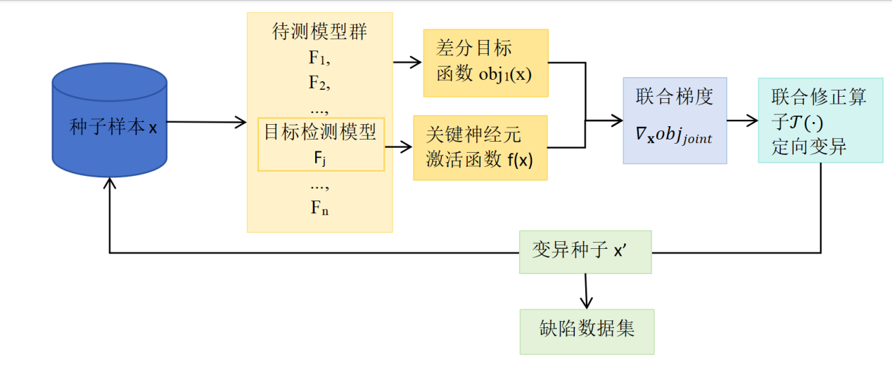

# 多维反馈驱动的中间层安全分析与测试框架

## 研究方案

### （1）总体方案

本项目针对图像分类类深度神经网络的安全性测试问题。在实际部署中，模型面临的输入远比训练数据丰富和复杂，但对边缘场景的稀有样本进行人工标注既昂贵又难以覆盖充分。本项目在白盒或半白盒条件下，构建一套自动化的安全缺陷发现方法，同时为缺陷的成因分析提供辅助解释。框架运行需要访问模型的输出概率、中间层激活和输入梯度，对其他任务类型和网络架构的适配属于后续扩展。

方案的整体思路分为行为感知、结构定位和约束生成三个环节，三者形成协同闭环。在行为感知环节，框架借鉴差分测试的思路，选用多个功能相似但结构不同的模型对同一输入进行预测。这些模型共享相同的输入格式和标签空间。当参考模型对一个输入达成共识，而目标模型给出不同的预测时，这种分歧就成为潜在的缺陷信号。这种做法减少了对人工标注的依赖，但分歧信号并不直接等于真实错误，后续还需要结合多数投票、原始标签或人工抽查来确认。

差分信号能告诉我们"这里可能有问题"，但不能告诉我们"问题出在模型的哪里"。要回答后一个问题，需要深入模型的中间层。框架从大量神经元中筛选出对决策贡献较高的关键子集，筛选方式以训练集上的激活频率为基础，再结合梯度归因进行加权，避免只看激活频率而忽略了真正参与决策的神经元。关键神经元覆盖率可以衡量测试对这些关键结构的探索程度，并引导后续的样本生成向未覆盖区域倾斜。不同缺陷样本在这些关键神经元上的激活模式也可以用作分类依据，帮助区分不同类型的缺陷。

但是如果只追求触发差分行为和提升覆盖率，生成的样本很容易偏离原始输入的语义，变成人类无法理解的噪声图像。为此，框架在生成过程中引入语义约束，通过度量变异前后的语义距离来限制偏移程度。后续还计划探索基于神经元语义描述的决策路径表示，为缺陷成因提供辅助解释。

上述三个环节共同作用于一个联合优化框架。差分目标、覆盖目标和语义约束被整合到同一个优化函数中，由梯度驱动输入变异。候选样本如果触发了预测分歧就进入缺陷集合，如果带来了新的覆盖则回收到种子池继续迭代。框架还根据每轮的覆盖增长、缺陷触发和语义偏移情况动态调整各目标的权重，让测试在不同阶段自动调整侧重方向。

这一做法与已有工作存在明确区别。DeepXplore 提出了差分测试和神经元覆盖的联合优化，但它把所有神经元同等对待。CriticalFuzz 关注了关键神经元的覆盖，但它的测试生成依赖图像变换，没有把差分行为纳入梯度优化。NSGen 引入了语义描述来引导测试生成，但语义相似度只用于种子筛选，不参与优化过程本身。本项目的工作是把这三条线索——差分行为、关键神经元覆盖和语义约束——放到同一个梯度驱动的优化框架里，并用动态反馈来协调它们的权重。

实验将在 ResNet50、VGG16-BN、MobileNetV2 等异构模型上展开，数据集覆盖 ImageNet 和 CIFAR 类任务。验证采用逐步消融的方式，从纯差分测试开始依次加入各模块，考察它们在缺陷发现、覆盖效果、语义质量、缺陷多样性和运行开销等方面的贡献。方法本身也有局限：差分测试无法发现所有模型共同犯的错误，覆盖率的提高不一定对应更强的缺陷发现能力，语义约束能限制漂移但不能严格保证语义不变。本框架旨在为图像分类类深度神经网络的安全性评估提供方法支撑和实验依据。

### （2）关键技术研究方案

#### 2.1 差分行为驱动的潜在缺陷捕获技术

在自动驾驶、恶意软件检测等场景中，深度学习模型的安全性测试面临先知缺失的问题：对于长尾分布中的稀有样本，很难通过人工手段获取准确标注。针对深度学习模型在复杂、长尾分布场景下难以通过人工标注数据进行完备性测试的问题，本技术模块借鉴软件工程中的差分测试思想，框架选用多个面向同一任务、共享同一标签空间但架构或训练过程不同的模型（如 ResNet-50、VGG16-BN、MobileNetV2）互为交叉引用先知，以模型间的预测不一致作为测试目标，降低对人工标注的依赖。这些模型由于架构和训练过程不同，各自的决策边界位置也不同。当一个输入落在某个模型的决策边界附近时，该模型的预测容易发生变化，而其他模型可能仍然保持原有判断。差分测试正是利用这种边界差异来定位潜在缺陷：通过引导输入向目标模型的决策边界演化，触发预测错误或鲁棒性退化等潜在安全缺陷。

差分测试的成立依赖一个基本前提：参与测试的模型需要面向同一任务，接受相同格式的输入并输出相同标签空间中的预测。只有满足这个条件，不同模型的预测结果才具有可比性。在此基础上，框架在测试开始前先对种子集进行筛选：将候选种子送入所有模型，只保留所有模型预测一致的样本作为有效种子，并将该一致预测记为初始共识标签 $c$。从不一致的种子开始测试没有意义，因为如果模型在变异之前就已经分歧，后续的分歧就无法归因于变异操作。需要注意的是，共识标签 $c$ 不一定是样本的真实标签，它只是所有模型在当前输入上的一致判断。

##### 2.1.1 多模型差分行为一致性建模

框架建立多模型协同的白盒监控机制，将同一输入x同时馈送至待测模型与参考模型群，通过捕捉模型间对同一输入的预测分歧，可以将”分歧信号”直接转化为”缺陷触发信号”，从而实现无需人工干预的自动化缺陷发现。框架需要计算目标函数对输入的梯度，以此确定变异方向，这要求能够访问模型的权重和前向计算过程。

在缺陷判定上，框架采用的规则比一般的"任意模型分歧"更严格。对于初始共识标签为 $c$ 的种子样本，如果变异后目标模型的预测偏离了 $c$，而所有参考模型仍然预测为 $c$，则该变异样本被记录为目标模型的候选缺陷样本。利用异构模型对特征敏感度的差异性，当所有参考模型对某一输入达成稳健共识，而待测模型产生预测偏移时，这种“认知失调”状态即精准锁定了待测模型的逻辑薄弱点。之所以要求参考模型保持共识，是因为只有在这种条件下，预测偏离才能比较明确地指向目标模型本身的问题。如果参考模型之间也出现了分歧，说明模型群整体对该输入区域缺乏一致判断，目标模型的偏离可能不是因为它的决策逻辑有缺陷，而是因为这个输入区域本身就处于多个模型的共同边界附近。这类样本不能直接归因于目标模型，应单独统计或进入待核验集合。

需要说明的是，即使满足了上述判定条件，模型间的预测分歧仍然只是候选缺陷信号，不能直接等同于目标模型的真实错误。分歧可能源于参考模型本身的偏差——多个参考模型达成的共识未必正确；也可能因为变异后的输入已经偏离了原始语义，导致预测变化本身是合理的。候选缺陷样本的有效性需要在后续评估中结合多数投票、原始标签或人工抽查来确认。

##### 2.1.2 差分目标函数构建

有了共识建模和缺陷判定规则之后，接下来的问题是如何引导输入变异的方向。如果只做随机扰动或预设的图像变换（如旋转、模糊、遮挡），变异方向与差分行为之间没有直接联系，大量变异操作不会产生有意义的分歧，效率很低。为了在测试过程中人为且高效地制造上述“认知失调”，本研究利用深度神经网络的可微性，构建了差分目标函数 $obj_{1}(\mathbf{x})$ 。

假设有 $n$ 个功能相近的预训练深度网络 $F = \{ F_{1},F_{2},..,F_{n}\}$，种子样本为 $\mathbf{x}$，所有模型对该样本达成的初始共识标签为 $c$。选取目标模型 $F_{j}$ 作为测试对象，目标是通过修改输入 $\mathbf{x}$，使 $F_{j}$ 偏离共识，同时尽量让参考模型保持原有预测。差分目标函数定义如下：

$$obj_{1}(\mathbf{x}) = \sum_{k \neq j}^{}F_{k}(\mathbf{x})\lbrack c\rbrack - \lambda_{1} \cdot F_{j}(\mathbf{x})\lbrack c\rbrack$$

其中 $F_{k}(\mathbf{x})\lbrack c\rbrack$ 是模型 $F_{k}$ 将输入预测为类别 $c$ 的概率。这个函数包含两个方向的作用：前半部分保持参考模型对共识类别的置信度，后半部分降低目标模型对共识类别的置信度。当函数值增大时，目标模型对 $c$ 的置信度在下降，而参考模型对 $c$ 的置信度在维持或上升——这正是我们希望制造的差分行为方向。

$\lambda_{1}$ 是平衡参数，控制两个方向之间的权重。较大的 $\lambda_{1}$ 会让优化更侧重于推动目标模型偏离共识，但也可能导致参考模型的共识被破坏，因此需要结合步长和扰动预算来调节。

该函数通过最小化目标模型 $F_{j}$ 在正确类别 $c$ 上的置信度，同时最大化其他模型的置信度，人为制造”认知失调”，为后续变异提供方向信号。通过该函数的指引，变异引擎不再是无目的的像素扰动，而是能够沿着梯度下降最快的方向，人为制造出让待测模型“产生误判”而参考模型“保持清醒”的极端冲突样本。这种定向的认知失调诱导机制，能够极大提高对决策边界处长尾缺陷的捕获效率，为后续的决策归因提供精准的失效实证。

这一机制也有局限。差分测试依赖模型间决策边界的差异，如果所有模型对同一输入产生相同的错误，分歧信号就无法暴露该缺陷。模型之间的决策边界越接近，让一个模型偏离而其他模型不变的空间就越小，搜索也就越困难。梯度优化本身也只能提供局部搜索方向，不保证全局最优。为弥补这些不足，本项目在后续模块中引入关键神经元覆盖引导和语义约束来补充差分信号。差分目标负责将输入推向模型间的决策边界差异区域，其产生的候选缺陷样本和对应的中间层激活，将作为 2.2 节关键神经元定位和缺陷分类的输入。

#### 2.2 中间层关键神经元识别

差分测试能够发现模型间的预测不一致，但它只提供行为层面的信号——我们知道目标模型在某个输入上犯了错，却不知道错误来源于模型内部的哪些结构。要从"发现问题"推进到"定位问题在哪里"，需要深入模型的中间层，分析哪些神经元对模型的决策有实质性影响。

DeepXplore 首次将神经元覆盖率引入 DNN 白盒测试，为模型内部结构探索提供了一个可量化的指标。但普通神经元覆盖把所有神经元等权对待，只回答"测试激活了多少神经元"，不能区分这些神经元是否真正参与了模型的主要决策。后续研究也指出，简单提高神经元覆盖率并不总是带来错误检测能力的同步提升,这说明覆盖信号本身是有价值的，但覆盖目标需要与测试目标更好地匹配。

本模块从大量中间层神经元中筛选出对决策有较强影响的关键子集，以此为基础建立覆盖指标、推导与差分目标的联合梯度接口，并利用关键神经元的激活模式对缺陷样本进行分类。筛选方式综合了两个维度：训练集上的激活频率和归因方法估计的决策贡献度，将二者融合为本项目的综合关键度指标。

##### 2.2.1 关键神经元定义与度量

深度神经网络的中间层包含大量神经元，但并非所有神经元对最终预测都有同等贡献。有些神经元在大多数输入上都会被稳定激活，编码了模型经常使用的特征模式；有些只在少数输入上偶然被激活，可能只是对特定噪声或低层纹理的响应。如果把所有神经元同等对待，测试资源会分散到大量对决策无关紧要的神经元上。本模块的第一步是从中间层中筛选出对决策有较强影响的关键神经元子集，将测试目标从"覆盖更多神经元"收缩为"覆盖更可能参与决策的神经元"。

本项目以训练集上的激活频率作为关键神经元筛选的基础指标。给定训练集 $D$、神经元 $n$ 和激活阈值 $t$，当神经元在输入 $x$ 上的输出超过 $t$ 时判定为激活。神经元的关键度 $CL(n,D)$ 定义为它在训练集中被激活的样本比例。当关键度超过阈值 $\tau$ 时，该神经元被纳入关键神经元集合 $\mathcal{D}_{en}$。这一指标沿用 CriticalFuzz 的思路，其背后假设是：在大量训练样本上被稳定激活的神经元更可能编码了模型常用的特征模式，比偶然激活的神经元更值得作为测试目标。该定义的有效性已被 CriticalFuzz 的干预实验所验证——将关键神经元输出置零后，所有被测模型的预测不一致率均达到 100%；而置零非关键神经元后的不一致率大多不超过 40%（ResNet20 例外，达到 70.80%）。这一对比表明，按激活频率筛选出的关键神经元与模型预测确实有较强关联，但非关键神经元也非完全无影响，阈值和模型结构都会影响划分效果。

关键集合的规模由阈值 $\tau$ 决定。参考实验显示，关键神经元占全部神经元的比例在 30% 到 82% 之间浮动。阈值过低时关键集合过大，覆盖指标退化为类似普通覆盖的行为；阈值过高时集合过小，可能遗漏在特定类别或边界输入上有作用的神经元。本项目需要在实验中对比不同阈值下的关键集合规模、覆盖增长曲线和缺陷触发率，用数据确定合适的工作阈值。

在实际操作中，框架对目标模型的所有中间层逐层扫描，对每一层的每个神经元计算关键度。扫描完成后按关键度降序排列，阈值 $\tau$ 以上的神经元构成该层的关键子集，所有层的关键子集合并为全局关键神经元集合 $\mathcal{D}_{en}$。 这个过程只需要在测试开始前执行一次，后续的覆盖跟踪和梯度计算都基于已确定的 $\mathcal{D}_{en}$，不需要在每轮迭代中重新识别。

但仅用激活频率存在明显局限：频率高不代表对决策贡献大，频率低也不代表不重要。一个在 80% 训练样本上都激活的神经元可能只在提取低层通用特征（如边缘或纹理），对分类决策贡献很小；一个只在 20% 样本上激活的神经元可能恰好编码了区分相似类别的关键特征。为此，本项目引入归因贡献作为第二个维度。归因方法不依赖训练集的统计频率，而是直接度量神经元输出变化对模型最终预测的影响程度，与频率指标互补。

基于频率和贡献度两个维度，本项目构建了综合关键度指标。对于神经元 $n$，其敏感度 $S(n,c)$ 定义为该神经元输出对类别 $c$ 预测分数的梯度贡献在类别数据上的期望：

$$S(n,c) = E_{x \in D_{c}}\left\lbrack \left| \frac{\partial F(x)_{c}}{\partial out(n,x)} \cdot out(n,x) \right| \right\rbrack$$

综合关键度将两个维度融合：

$$cl(n,T) = \alpha \cdot Freq(out(n,T) > t) + (1 - \alpha) \cdot Norm(S(n,c))$$

其中 $\alpha$ 控制频率项和贡献度项的权重平衡。当 $\alpha = 1$ 时退化为纯频率定义，当 $\alpha = 0$ 时退化为纯归因定义。这个融合不是对已有实验的直接复现，而是本项目将两条路线结合后的扩展。融合是否比单一频率带来实际收益，需要通过消融实验验证——实验中将对比纯频率、纯归因和融合三种配置下的覆盖效果和缺陷触发率。

进一步地，将训练集 $T$ 替换为类别 $c$ 的数据子集 $T_c$，可以得到针对特定类别的关键度指标。不同类别的关键神经元集合不完全重叠——处理"猫"和处理"卡车"的决策路径涉及不同的中间层结构。类关键神经元的识别支持后续的类别层面覆盖分析。此外，统计神经元在不同类别上的激活分布熵可以作为辅助参考：熵越低，说明该神经元越集中响应少数类别，具有较强的类别专属性。

##### 2.2.2 覆盖准则

在确定了关键神经元集合 $\mathcal{D}_{en}$ 之后，需要定义衡量测试对这些关键结构探索程度的指标。关键神经元覆盖率（CNCov）定义为：给定测试集 $Q$，如果存在某个测试样本使关键神经元 $n$ 的输出超过激活阈值，则认为 $n$ 被覆盖。CNCov 是已覆盖的关键神经元数量占关键集合总规模的比例。这个指标衡量的是测试过程对模型关键决策结构的探索广度——CNCov 越高，说明测试触达了更多可能影响决策的内部结构。在实际测试过程中，CNCov 从初始种子集的基线值开始，随着变异样本的生成逐渐增长。当增长速度变慢时，说明当前的变异策略已经难以触及新的关键神经元，需要调整方向或换用新的种子。CNCov 的增长曲线也可以作为测试终止条件的参考之一。

但全局 CNCov 有一个盲区。不同类别的决策路径并不完全相同，它们依赖的关键神经元集合存在差异。如果测试集集中探索了某几个类别相关的决策路径，全局 CNCov 可能已经较高，但其他类别的关键结构仍然未被触及。一个全局覆盖率达到 80% 的测试集，可能对某些类别的关键路径覆盖不足 30%。这种类别间的覆盖不均衡需要更细粒度的指标来揭示。

针对上述问题，研究引入类关键神经元覆盖率（CCCov），对类别 $c$ 的数据子集 $D_c$ 计算类关键神经元集合，CCCov 定义为测试集对该类关键集合的覆盖比例。CCCov 可以揭示哪些类别的关键决策结构已经被充分探索、哪些类别还存在盲区，从而指导种子选择和变异方向向覆盖不足的类别倾斜。例如，如果框架在测试过程中发现类别"鸟"的 CCCov 已经达到 90%，而类别"船"的 CCCov 只有 40%，种子选择策略可以优先选取与"船"相关的样本进行变异，使测试资源向覆盖薄弱的类别集中。

需要说明的是，覆盖率本身不等于缺陷发现能力。一个直觉的理解是：高覆盖率说明测试探索了更多的内部结构，但这些结构中是否存在真实的缺陷取决于模型本身的质量和测试输入的分布。已有实验显示，关键神经元覆盖比普通覆盖更能聚焦高价值结构，在其实验中表现出更好的错误检测效果。但覆盖率与缺陷发现之间的关系并非稳定的强相关——后续的研究已经指出，在某些条件下高覆盖率并不带来更多的缺陷发现。覆盖指标在本框架中的角色是引导信号而非最终评价标准：它帮助测试生成过程向未探索的关键结构方向倾斜，避免变异集中在已经充分覆盖的区域。但最终的测试有效性需要通过缺陷数量、缺陷多样性和消融实验来综合评价。本项目将在实验中同时报告 CNCov/CCCov 增长曲线和缺陷触发数量，考察二者之间的实际关联。

##### 2.2.3 联合梯度推导

如果只追求差分行为，变异方向完全由模型间的决策边界差异决定。这可以有效触发预测不一致，但搜索可能反复集中在同一段决策边界附近，不去探索模型内部其他尚未触达的脆弱结构。反过来，如果只优化关键神经元覆盖，变异方向会尽量激活更多未覆盖的关键神经元，覆盖率会上升，但激活这些神经元不一定会导致模型预测出错。两个目标各有盲区：差分目标提供的是"模型确实犯了错"的行为信号，覆盖目标提供的是"探索了新的内部结构"的进展信号。将二者耦合，可以让变异同时朝着触发错误和探索新结构两个方向进行。

本项目的做法是将差分目标和关键覆盖目标写入同一个梯度优化过程。这一形式继承了 DeepXplore 的联合梯度思路，但将其中的普通神经元覆盖项替换为关键神经元覆盖项——CriticalFuzz 虽然提出了关键覆盖的概念，但其测试生成依赖图像变换而非梯度优化。本项目把这两者结合起来：每一步变异的梯度方向同时包含两个分量，差分目标的梯度推动输入接近模型间决策边界差异区域，覆盖目标的梯度推动输入激活尚未触达的关键神经元。两个方向加权合并后，变异在每一步都同时追求行为分歧和结构探索。

需要注意的是，两个梯度方向并不总是一致的。差分目标可能引导输入向某个方向移动以触发预测错误，而覆盖目标可能引导输入向另一个方向移动以激活某个特定的关键神经元。当两者方向接近时，变异效率最高——一次更新同时推进了行为探索和结构探索。当两者方向冲突时，加权合并的结果是一个折中方向，权重参数 $\lambda_2$ 决定了覆盖目标在合并中的影响力。如果 $\lambda_2$ 设为 0，联合优化退化为纯差分测试；如果 $\lambda_2$ 过大，覆盖目标可能压过差分目标，导致生成的样本虽然覆盖了新的关键神经元但没有触发预测错误。权重的动态调整机制将在 3.2 节中讨论。

由于关键神经元的激活输出是输入的可微函数，覆盖目标可以像差分目标一样参与梯度计算。具体的覆盖目标构造方式——选取未覆盖关键神经元中激活值最低的作为优化对象——以及完整的多目标优化函数（含后续 2.3 节的语义约束项），将在第 3.1 节中统一呈现。本节要建立的核心论点是：关键神经元覆盖是一个可微的优化目标，它可以与差分目标通过梯度运算合并为统一的变异方向，而不需要回退到随机图像变换。

##### 2.2.4 基于关键神经元激活模式的缺陷分类

差分测试框架能够自动发现大量的缺陷样本，但数量本身不能说明测试的充分性。如果数百个缺陷样本实际上都触发了同一段决策边界上的同一个弱点，它们虽然数量多，但并没有暴露模型中不同位置的不同问题。要评估测试的有效性，需要衡量缺陷的多样性——框架是否发现了多种不同类型的问题，而不只是反复命中同一个。

本项目利用关键神经元的激活模式来区分不同类型的缺陷。每个缺陷样本在经过目标模型前向传播后，会在关键神经元集合 $\mathcal{D}_{en}$ 上产生一个激活向量——记录每个关键神经元的激活程度。这个向量可以看作缺陷样本的内部激活指纹，它反映了该样本触发缺陷时所经过的中间层路径。如果两个缺陷样本的激活指纹相似，说明它们经过了相似的内部路径，触发的可能是同一类缺陷；如果差异较大，说明它们暴露了模型中不同区域的问题。

这一思路与 NSGen 的缺陷分类方案存在路线差异。NSGen 通过外部语义数据库（MILANNOTATIONS）获取神经元的自然语言描述，构造语义决策路径，再用 CLIP 计算路径相似度来区分缺陷类型。该做法可解释性较强，但泛化范围受限于外部数据库的覆盖。本项目选择直接使用关键神经元激活向量作为内部路径表示，不引入额外的外部依赖，与前述的覆盖引导机制在逻辑上保持一致。

具体做法是对所有缺陷样本提取关键神经元激活向量，然后对向量集合进行聚类分析。聚类方法的选择需要考虑缺陷样本的数量和分布特征。当缺陷数量较少时，层次聚类可以通过树状图直观展示样本间的距离关系；当缺陷数量较多时，基于距离阈值或轮廓系数的自动聚类更为实用。每个聚类簇代表一类缺陷模式，簇的数量反映了测试发现的缺陷多样性。由于关键神经元集合的规模通常在数百到数千个之间，激活向量的维度较高，聚类前可以通过降维或只保留激活值变化最大的维度来减少计算开销。样本间距离可以采用余弦距离或欧氏距离，具体选择取决于是否更关注激活模式的方向还是幅值。结合每个簇内样本的类别对信息——原始共识类别与目标模型错误预测类别的对应关系——可以进一步描述每类缺陷的具体表现。例如，某个簇可能集中了"猫被误判为狗"的样本，而另一个簇集中了"卡车被误判为汽车"的样本。

缺陷分类的结果可以反馈给测试生成过程。当某一类缺陷模式的样本数量已经充足，继续在该模式上投入变异资源的边际收益递减，框架可以降低该类模式对应种子的优先级，将资源转向探索尚未触及的缺陷模式。这一机制与 3.2 节的动态反馈思路呼应：测试过程不仅追求缺陷的数量，还追求缺陷的多样性。评价指标包括簇数量、每簇的类别对分布、各簇的缺陷触发率以及簇间的平均距离。簇间距离越大，说明框架发现的不同缺陷模式之间差异越明显，缺陷多样性越高。

需要说明的是，激活模式聚类是一种多样性指标，不是严格的根因诊断工具。同一个簇中的缺陷样本具有相似的关键神经元激活模式，但这不等于它们必然共享相同的根因。激活模式的相似性提供的是结构层面的线索，而不是因果层面的证明。缺陷分类结果的解释仍然需要结合类别对分析、样本可视化和人工抽查来进行。

#### 2.3 融合语义约束的测试生成优化算法

目前的深度学习模型测试生成方法主要依赖像素级的随机扰动或纯数学梯度引导，这类方法往往忽略了神经元激活模式与输入语义之间的内在联系。由于缺乏有效的语义约束，生成的测试用例在不断提升神经元覆盖率的过程中，极易偏离原始输入的语义流形，产生人类无法理解的无效噪声样本。这种"语义漂移"不仅降低了测试的真实性，也使得发现的模型缺陷难以被开发者直观理解或用于指导模型修复。

针对上述语义失真问题，本部分研究旨在构建一套神经元语义引导的自适应测试生成优化算法。通过挖掘模型中间层神经元激活向量与输入语义特征之间的映射关系，将模糊测试过程中的变异方向限制在语义合理的区域内。通过引入语义相似度度量与能量调度机制，在优化关键神经元覆盖的同时，确保生成样本与原始种子在语义空间保持一致，从而生成既能触发模型失效、又具备实际物理意义的高质量边缘测试用例。

##### 2.3.1 神经元激活向量驱动的语义相似度建模

针对语义一致性缺失的瓶颈，本研究旨在构建一种基于神经元激活向量的语义表征与相似度建模方法。模型中间层神经元的联合激活状态不仅反映了特征的提取程度，更编码了样本的深层语义信息。通过将原本高维且抽象的输入特征投影到神经元激活空间，本研究建立了一套可量化的语义相似度度量函数。该方法旨在为后续的变异过程提供精确的"语义约束边界"，确保生成的测试样本在保持攻击性的同时，不脱离人类可理解的逻辑范畴。

通过模型的前向传播过程，本研究对于每一个输入的测试样本x和原始种子x0，同步捕获其在预先选定的关键中间层中的激活轨迹。将这些神经元的激活值按空间位置排列成向量形式，即得到激活向量v(x)与v(x0)。通过描述输入样本在模型"认知空间"中的高维特征，刻画比像素点更本质的样本语义属性。

为了精确量化样本在变异过程中的语义偏移量，本研究采用余弦相似度来构建语义相似度度量函数$S(x,x_{0})$。由于余弦相似度关注的是向量方向的一致性而非绝对幅值，这使其在处理由于光影、噪声等干扰引起的神经元响应波动时具有较强的鲁棒性。计算公式如下：

$$S(x,x_{0}) = \frac{v(x) \cdot v(x_{0})}{\| v(x)\| \cdot \| v(x_{0})\|}$$

该函数的取值范围在\[-1, 1\]之间，得分越接近 1，表示变异样本与原始种子在模型内部激发的逻辑路径越一致，即样本的语义特征保持越完好。

当变异样本x在梯度指引下向决策边界移动时，系统会实时监控$S(x,x_{0})$的动态变化。一旦该指标低于预设的语义保持阈值$\gamma$，系统将判定当前变异已引发语义漂移，从而触发强制的回退或修正算子。通过这种方式，本方法实现了对样本演化过程的量化约束，确保生成的每一个边缘失效样本都具备坚实的语义基础。

##### 2.3.2 多维融合的种子能量分配策略

针对在深度学习模型的模糊测试过程中，测试效率往往受限于种子选取的盲目性与计算资源分配的不合理性的问题，本研究旨在构建一种融合语义增量与覆盖收益的自适应能量分配策略。通过实时量化种子样本在演化过程中带来的语义稳定性贡献与神经元覆盖增量收益，动态调节其变异权重。自适应地为高价值演化分支分配更多变异机会，确保计算资源能够精准聚焦于那些既能深度探测模型逻辑漏洞、又能严谨遵循原始语义流形的种子，从而在提升测试深度的同时保障测试结果的真实性与可解释性。

系统在每一轮变异后，通过计算生成样本与原始种子之间的神经元激活向量余弦相似度，对其进行语义收益评估。算法会优先保留并在后续演化中选择那些在神经元激活空间中表现稳定、语义得分保持在合理阈值范围内的种子。这种筛选机制有效防止了因过度变异导致的语义突变，确保了变异过程始终在受控的语义边界内进行，从而筛选出更具业务逻辑合理性的演化路径。

在满足语义约束的前提下，同步监测样本对关键神经元覆盖率的贡献度。如果一个变异样本成功激活了此前在测试过程中从未被探测到的关键神经元，即产生了显著的 CNCov 增量，系统将判定该种子具备极高的"逻辑探测价值"。对于此类展现出深度探索潜力的种子，赋予其更高的初始能量值或增加其在变异循环中的权重，以激励系统对其进行更深入的演化搜索。

最终，根据上述语义收益与覆盖收益的加权结果，对种子库进行动态能量调度。通过这种自适应调节，变异能量将从低收益、语义漂移的样本自动向高增量、语义一致的高价值演化分支集中。这种闭环反馈机制确保了测试框架能够自主识别并深耕模型决策逻辑中的脆弱区域，实现了在海量状态空间中对高质量、高解释性模型缺陷的高效诱捕。

##### 2.3.3 白盒定向变异

现有的对抗攻击技术往往生成仅含数学噪声的样本，虽能误导模型，却缺乏实际物理意义。现有白盒测试生成的样本往往仅在像素层进行扰动，虽能触发分歧，但易偏离真实语义流形，导致测试结果缺乏实际修复参考价值。本研究的创新点在于，通过引入语义一致性约束机制，将变异过程从简单的像素级微调提升至特征空间的定向演化。确保生成的缺陷样本在视觉或语义层面保持合理性，从而使发现的缺陷具备实际修复价值和可解释性。

在变异执行过程中，本研究引入双层约束架构作为语义一致性保障。底层为预设的物理环境算子，限制梯度上升搜索的变异边界，确保生成的样本不偏离真实数据的基本物理流形；高层为语义一致性投影。利用第（3）部分定义的联合优化梯度指引样本变异：

$$\mathbf{x}_{i + 1} = \mathbf{x}_{i} + s \cdot \mathcal{T}(\nabla_{\mathbf{x}}\mathcal{J})$$

其中：步长 $s$ 用于控制单次变异的扰动强度，$\mathcal{T}( \cdot )$ 为联合修正算子。

系统并不直接应用原始梯度，而是通过一个约束算子对其进行修正。通过迭代更新 $s \cdot \mathcal{T}(\nabla_{\mathbf{x}}\mathcal{J})$，样本在输入空间中沿着特定路径向决策边界移动，最终生成既能触发模型错误行为，又符合人类视觉认知的"高质量边缘样本"。该算子首先应用领域特定约束 DOMAIN_CONSTRAINTS（如模拟真实光照、局部遮挡）来保证样本的物理可实现性；随后利用特征空间投影技术限制梯度在语义敏感区域的剧烈波动。

这种修正机制的作用在于，它不仅确保了样本能有效跨越差分边界触发模型分歧，更通过保持输入数据的高维特征属性，使发现的缺陷具备极高的真实感与逻辑一致性。确保了测试发现的"坏样本"是模型逻辑层面的本质缺陷而非数学噪声干扰，从而为后续开展深层特征映射与决策路径归因分析奠定了高质量的实证基础。

### （3）覆盖驱动与语义引导的联合优化测试框架

前面三个技术模块分别解决了差分行为捕获（2.1）、关键神经元识别与覆盖度量（2.2）、语义约束下的定向变异（2.3）三个问题。但在实际测试中，三个目标之间存在矛盾：过度追求差分行为会使生成样本偏离真实数据分布；单纯提升覆盖率可能在不重要的神经元上浪费资源；而语义约束过强又会限制对决策边界的探索。因此，需要将三个目标纳入同一个优化框架中进行平衡，并根据测试进展动态调整各目标的优先级。

#### 3.1 多目标联合优化函数

将差分行为、关键神经元覆盖和语义一致性三个目标整合为一个联合优化函数：

$$obj_{total}(\mathbf{x}) = obj_{1}(\mathbf{x}) + \lambda_{2} \cdot obj_{cov}(\mathbf{x}) - \lambda_{3} \cdot obj_{sem}(\mathbf{x})$$

其中 $obj_{1}(\mathbf{x})$ 为 2.1.2 节定义的差分目标函数，用于驱动输入向目标模型 $F_{j}$ 的决策边界移动。$obj_{cov}(\mathbf{x})$ 为关键神经元覆盖目标：在每一轮迭代中，从关键神经元集合 $\mathcal{D}_{en}$ 中找出尚未被测试集覆盖的神经元子集 $\mathcal{D}_{uncov}$，选取其中激活值最低的神经元 $n^{\ast}$，将其输出 $out(n^{\ast},\mathbf{x})$ 作为优化目标，使测试输入朝着激活这些未覆盖神经元的方向变异。$obj_{sem}(\mathbf{x})$ 为语义偏移惩罚项，度量变异后的样本与原始种子在语义空间中的距离，取负号表示需要最小化语义偏移，防止生成样本脱离真实数据分布。$\lambda_{2}$ 和 $\lambda_{3}$ 为权衡超参数，分别控制覆盖目标和语义约束的强度。

由于上述三个目标函数均基于可微的神经网络运算，$obj_{total}$ 可直接对输入 $\mathbf{x}$ 求梯度，所得梯度即为 2.3.3 节中联合修正算子 $\mathcal{T}( \cdot )$ 的输入，指导样本在输入空间中的变异方向。

#### 3.2 动态反馈与自适应权重调整

在测试过程中，三个目标的相对重要性会随测试进展变化。测试初期关键神经元覆盖率较低，覆盖目标更重要；随着覆盖率接近饱和，应当将更多资源分配给差分行为的探索。为此，本研究引入基于测试状态的动态反馈机制，在迭代过程中自动调整 $\lambda_{2}$ 和 $\lambda_{3}$。

每轮迭代结束后，系统计算三个反馈指标：覆盖增长率 $\Delta CNCov$（本轮与上一轮的关键神经元覆盖率之差）、缺陷触发率 $RFT$（本轮生成的样本中触发了模型预测错误的比例）、语义偏移均值 ${\bar{d}}_{sem}$（本轮所有生成样本的平均语义偏移距离）。当 $\Delta CNCov$ 连续多轮低于阈值 $\delta_{cov}$ 时，说明覆盖增长已趋于饱和，此时降低 $\lambda_{2}$，将资源从覆盖扩展转向差分行为探索；当 ${\bar{d}}_{sem}$ 超过阈值 $\delta_{sem}$ 时，提升 $\lambda_{3}$ 以加强语义约束；当 $RFT$ 持续低于阈值 $\delta_{fault}$ 时，提升 $\lambda_{2}$，促使测试输入覆盖更多未探索的关键神经元，尝试触发新的错误模式。这种机制使框架在不同测试阶段自动调整策略，不需要人工干预超参数的设置。

#### 3.3 迭代测试流程

将上述优化目标与反馈机制组织为三阶段的迭代流程。

初始化阶段，从测试数据集中随机选取种子样本集 $S_{0}$，加载待测模型群 $F = \{ F_{1},F_{2},...,F_{n}\}$，对目标模型 $F_{j}$ 执行关键神经元识别（2.2.1 节），得到关键神经元集合 $\mathcal{D}_{en}$ 及各类别的关键神经元子集，计算种子集的初始覆盖率 $CNCov_{0}$，并设定 $\lambda_{1}$、$\lambda_{2}$、$\lambda_{3}$ 的初始值。

迭代生成与评估阶段，每轮迭代依次执行以下步骤：（1）从种子池 $S_{i}$ 中选取种子 $\mathbf{x}$，优先选择已覆盖了接近关键神经元的种子；（2）计算 $\nabla_{\mathbf{x}}obj_{total}$，经修正算子 $\mathcal{T}( \cdot )$ 施加领域约束和语义投影后，按 2.3.3 节的方式生成候选样本 $\mathbf{x}'$；（3）将 $\mathbf{x}'$ 输入所有模型，若目标模型 $F_{j}$ 的预测与其他参考模型不一致，则判定为缺陷样本，加入缺陷数据集 $D_{fault}$；（4）检查 $\mathbf{x}'$ 是否激活了新的关键神经元并更新覆盖率，若覆盖了新的关键神经元则将 $\mathbf{x}'$ 加入种子池供后续迭代使用；（5）计算 $\Delta CNCov$、$RFT$、${\bar{d}}_{sem}$，按 3.2 节的规则调整 $\lambda_{2}$ 和 $\lambda_{3}$。

终止与输出阶段，满足以下任一条件时停止迭代：$CNCov$ 达到预设目标值；连续多轮覆盖增长率和缺陷触发率均低于阈值；达到最大迭代次数或时间限制。测试结束后，输出缺陷数据集 $D_{fault}$、覆盖率报告以及各轮反馈指标的变化记录。
